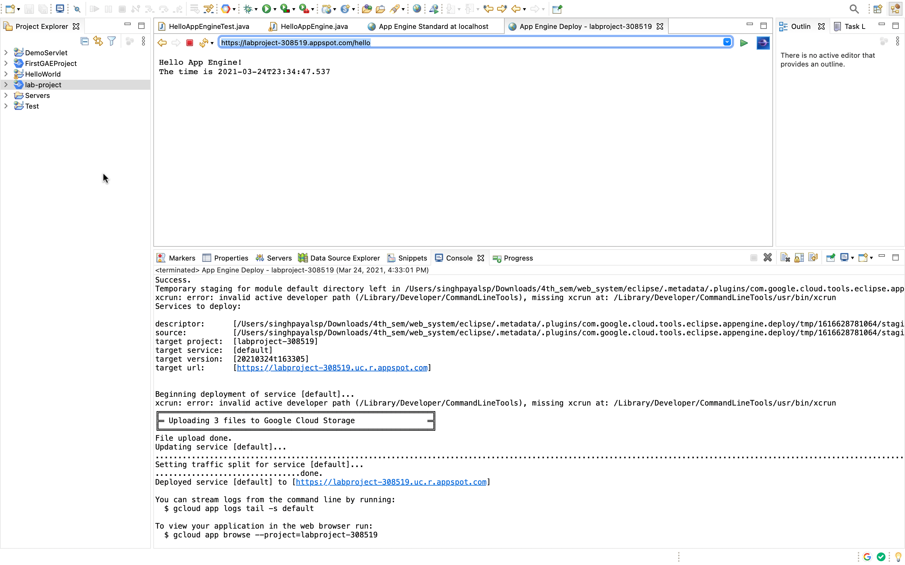
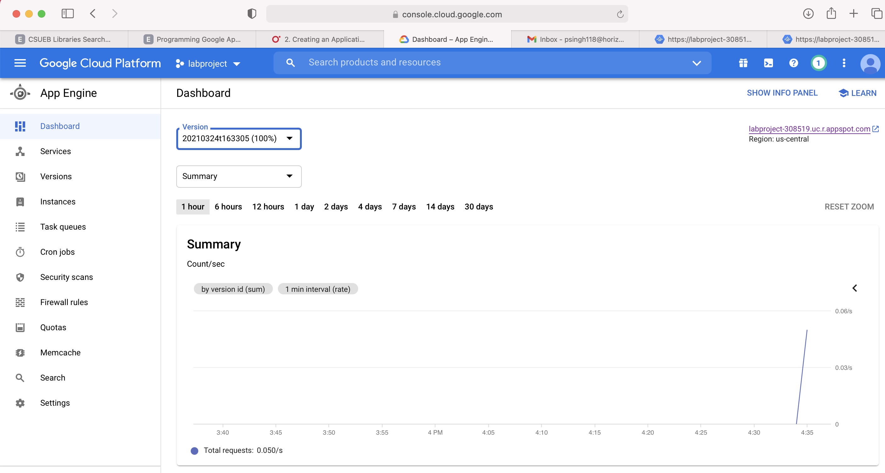

# Servlet application running on GAE (Google App Engine) using Eclipse IDE

### Servlet app running screenshot

### GAE dashboard with Servlet app running screenshot

### GAE URL

[https://labproject-308519.appspot.com/hello](https://labproject-308519.appspot.com/hello)
